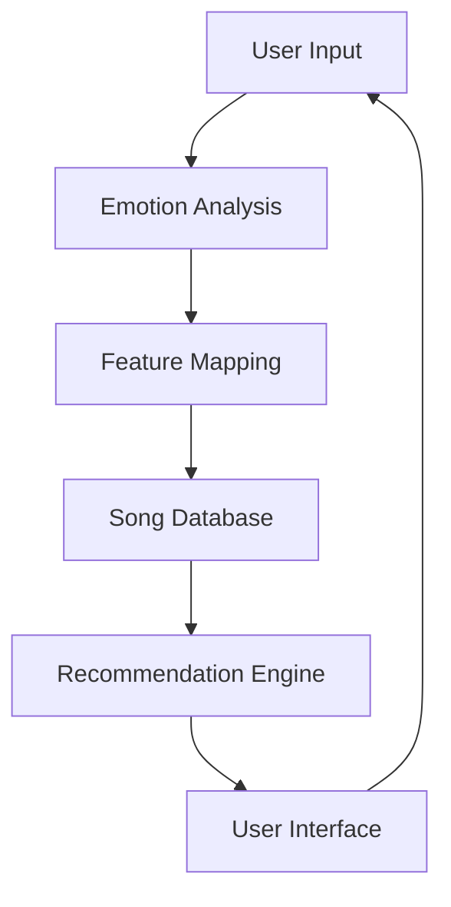

# 🎵 Emotion-Based Song Recommender

A sophisticated music recommendation system that suggests songs based on your emotional state using advanced Natural Language Processing and Machine Learning.


## 🌟 Features

- **Advanced Emotion Detection**: Uses DistilBERT model to accurately detect 6 different emotions:
  - Joy 😊
  - Sadness 😢
  - Anger 😠
  - Fear 😨
  - Love ❤️
  - Surprise 😮

- **Intelligent Song Matching**: Maps emotions to musical characteristics:
  - Valence (musical positiveness)
  - Energy (intensity and activity)
  - Danceability
  - Tempo
  - Acousticness

- **Interactive Chat Interface**: Natural conversation flow with the system
- **Detailed Recommendations**: Explains why each song was recommended
- **Real-time Processing**: Instant emotion analysis and song suggestions

## 🚀 Quick Start

### Prerequisites

- Python 3.9 or higher
- pip (Python package manager)

### Installation

1. **Clone the repository**
```bash
git clone https://github.com/DarshanCode2005/Spotify-song-recommender.git
cd Spotify-song-recommender
```

2. **Create a virtual environment**
```bash
python -m venv venv
```

3. **Activate the virtual environment**

Windows:
```bash
.\venv\Scripts\activate
```

Unix/MacOS:
```bash
source venv/bin/activate
```

4. **Install dependencies**
```bash
pip install -r requirements.txt
```

5. **Run the application**
```bash
streamlit run app.py
```

## 💡 How It Works

1. **Emotion Detection**
   - Uses the `bhadresh-savani/distilbert-base-uncased-emotion` model
   - Analyzes user input to detect emotional state
   - Provides confidence scores for detected emotions

2. **Music Feature Mapping**
   - Maps detected emotions to specific musical characteristics
   - Uses sophisticated algorithms to match songs with emotional states
   - Considers multiple audio features for better matching

3. **Song Recommendation**
   - Analyzes a database of songs using their audio features
   - Finds the best matches for the current emotional state
   - Provides explanations for why each song was chosen

## 📊 Technical Architecture



## 🎯 Use Cases

- **Personal Mood Music**: Find songs that match your current emotional state
- **Playlist Generation**: Create emotion-based playlists
- **Music Discovery**: Find new songs based on your feelings
- **Emotional Support**: Get music recommendations during different emotional states

## 📝 Example Interactions

```
User: "I just got promoted at work!"
→ Detected: Joy 😊
→ Recommends: Upbeat, high-energy songs

User: "I'm feeling a bit down today"
→ Detected: Sadness 😢
→ Recommends: Calming, melodic songs

User: "I miss my family so much"
→ Detected: Love/Sadness ❤️😢
→ Recommends: Emotional, nostalgic songs
```

## 🛠️ Technology Stack

- **Frontend**: Streamlit
- **Backend**: Python
- **ML Models**: HuggingFace Transformers (DistilBERT)
- **Data Processing**: Pandas, NumPy
- **ML/AI**: Scikit-learn
- **Deep Learning**: PyTorch

## 📈 Future Improvements

- [ ] Multi-emotion detection
- [ ] Personalized user preferences
- [ ] Genre filtering options
- [ ] Playlist export functionality
- [ ] Integration with music streaming services
- [ ] Mobile app version

## 🤝 Contributing

Contributions are welcome! Please feel free to submit a Pull Request.

1. Fork the repository
2. Create your feature branch (`git checkout -b feature/AmazingFeature`)
3. Commit your changes (`git commit -m 'Add some AmazingFeature'`)
4. Push to the branch (`git push origin feature/AmazingFeature`)
5. Open a Pull Request

## 📄 License

This project is licensed under the MIT License - see the [LICENSE](LICENSE) file for details.

## 👏 Acknowledgments

- HuggingFace for the emotion detection model
- Streamlit for the amazing web framework
- The open-source community for various tools and libraries


---

Made with ❤️ and 🎵 